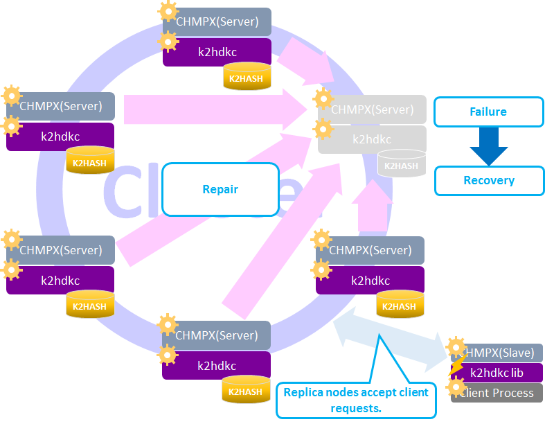
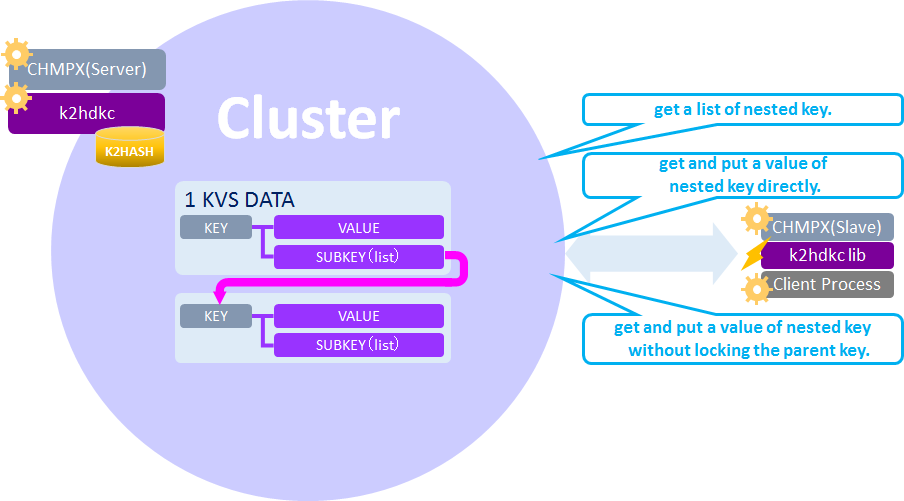

# Feature
**K2HDKC** is a highly available and scalable distributed KVS clustering system and also feature many useful and unique functions.

## Automated data synchronization between server nodes.
- Automatic Merging  
After recovering from transient node failures, data will be relocated automatically.
- Automatic Scaling  
When adding/removing nodes, data will be relocated automatically.

## Nested key structure
this functionality is derived from the [Sub key](https://k2hash.antpick.ax/feature.html) function of [K2HASH](https://k2hash.antpick.ax/).

## Queue
## CAS(Compare And Swap)
## Data Encryption
## Data Expiration
## Transaction Plugins
Changing data invokes user defined functions in the [K2HTPDTOR](https://k2htp_dtor.antpick.ax/) plugin.

# Automatic Merge
Automatic Merge is a processing mechanism that restores data consistency of a server node returning from the down state or suspended state to the normal state.  
_Note: The suspended state means the **K2HDKC** process is dead._

After recovering from transient node failures, **K2HDKC** automatically restores data of the failure node.

Let's see the flow to restore data.

| phase | status | description |
|-|-|-|
| #1 | Server node failure occurred. | The [CHMPX](https://chmpx.antpick.ax/) process or the **K2HDKC** process in a server node is dead.   The server node is unavailable in this situation. |
| #2 | Server node is still failing. | While a failure occurs, the replica node handles the request on behalf of the failed server node.   That's why clients can keep sending requests and getting responses without a server node. |
| #3 | Server node failure removed.  | The cause of the failure will disappear when the [CHMPX](https://chmpx.antpick.ax/) and **K2HDKC** process successfully restart.   Then the node becomes the [Pending] [CHMPX](https://chmpx.antpick.ax/) state.   The **K2HDKC** process starts gathering only data that it does not have from the replica node.   The failed node will not accept requests from clients during this situation. |
| #4 | Data merge completed.         | After gathering data from the replica node, the server node becomes the [UP and No Suspend] [CHMPX](https://chmpx.antpick.ax/) state.   The server node starts accepting requests from clients again. |

# Automatic Scaling
Automatic Scaling is a processing mechanism to relocate the data held by each server node when increasing or decreasing server nodes in the cluster. The Automatic Scaling is basically the same logic with the Automatic Merge.

**K2HDKC** determines the locations of keys in the cluster by calculator of keys and the number of nodes in the cluster. **K2HDKC** has no mapping of range and node though **K2HDKC**'s partitioning scheme relies on consistent hashing like Riak or Cassandra. When a new node is added to the cluster, **K2HDKC** detects the keys to be relocated and copies them to their locations.

Let's see the flow to move data when increasing nodes in the cluster.

| phase | action | status | description |
|-|-|-|-|
| #1 | Adding a node. |	Adding                  | The node becomes the [Pending] [CHMPX](https://chmpx.antpick.ax/) state and the **K2HDKC** state is [Doing]. |
| #2 |                | Starting merging data.  | Every node in the cluster voluntarily starts collecting its own data.  New node doesn't accept requests from clients.  Server nodes corresponding to the data arrangement before starting data merge still  accept requests from clients in this phase. |
| #3 |                | Completed merging data. | All nodes have finished collecting its own data.   New node starts accepting client requests. |

Let's see how data moves when decreasing nodes in the cluster.

| phase | action | status | description |
|-|-|-|-|
| #1 | Deleting a node | Deleting                | The node to be deleted from the cluster becomes the [Pending] [CHMPX](https://chmpx.antpick.ax/) state and **K2HDKC** state is [Doing].   In this phase, the node only  sends a decommission requests from the cluster and still receives requests from clients. |
| #2 |                 | Starting merging data.  | Every node except for the node to be deleted voluntarily start collecting its own data.   The node to be deleted only  sends a decommission requests from the cluster and still receives requests from clients.  In other words, Server nodes corresponding to the data arrangement before starting data merge still accept requests from clients in this phase. |
| #3 |                 | Completed merging data. | The node is completely decommissioned. All nodes finished collecting its own data.   When having completed merging data, all nodes automatically start accepting client requests based on the new data arrangement. |

If the target node is already in the down state (or suspended state) at the time of node deletion, the replica node will keep the data that the target node takes charge. It means the replica node can handle client requests in the merging data phase.

# Nested key structure
**K2HDKC** supports nested key data structure which means **K2HDKC** can store a key-value pair and a nested key-value pair. This functionality is derived from the [Sub key](https://k2hash.antpick.ax/feature.html) function of [K2HASH](https://k2hash.antpick.ax/).

# Queue
**K2HDKC** supports a FIFO(first-in-first-out) and LIFO(last-in-first-out) queue data structure which is also a [K2HASH](https://k2hash.antpick.ax/)'s function.
This means that **K2HDKC** can store a value and a key-value pair in a queue data structure.

# CAS(Compare And Swap)
**K2HDKC** supports CAS(compare-and-swap) operations by using [K2HASH](https://k2hash.antpick.ax/) and other mutex functionality. **K2HDKC** updates a value of a key after reading the current value of the key to check if it matches the expected one. Typical use cases of CAS operations are increment or decrement a counter, updating a mutex data item and so on.

# Data Encryption
**K2HDKC** supports data encryption which is also a [K2HASH](https://k2hash.antpick.ax/)'s function.
This is the reason why **K2HDKC** can securely store and manage sensitive data.

# Data Expiration
**K2HDKC** supports data expiration. **K2HDKC** deletes data with exhausted  time-to-live. A typical use case of this function is some kind of a cache system. The **K2HDKC**'s data expiration functionality comes from [K2HASH](https://k2hash.antpick.ax/).

# Transaction Plugins
**K2HDKC** can invoke user defined functions which is defined in [K2HASH](https://k2hash.antpick.ax/)'s `k2htpdtor` or custom transaction plugins after data has changed(`k2htpmdtor`) when changing data.

