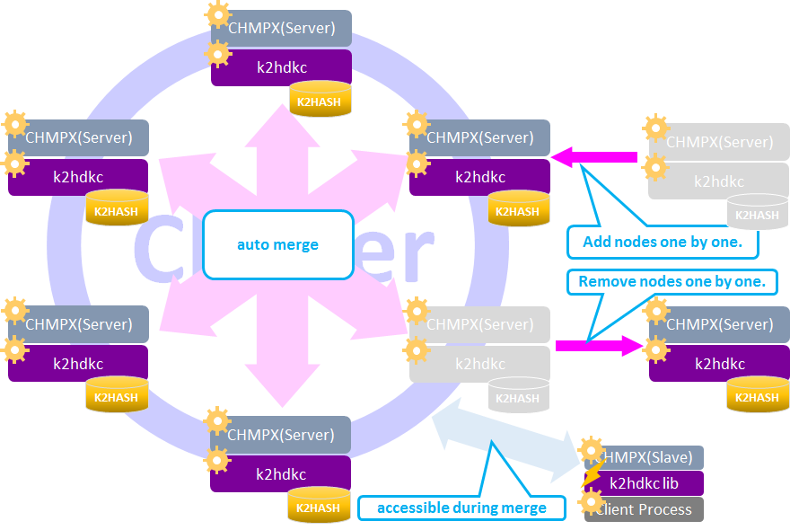
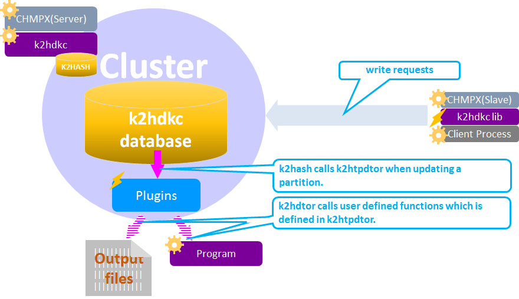

# 特徴
**K2HDKC**は、高可用性でスケーラブルな分散型KVSクラスタリングシステムであり、多くの有用でユニークな機能も備えています。

## 柔軟なインストール
K2HDKCは、あなたのOSに応じて、柔軟にインストールが可能です。あなたのOSが、Ubuntu、CentOS、Fedora、Debianなら、[packagecloud.io](https://packagecloud.io/antpickax/stable)からソースコードをビルドすることなく、簡単にインストールできます。それ以外のOSであっても、自身で[ビルド](https://k2hdkc.antpick.ax/buildja.html)して使うことができます。

## サーバーノード間の自動データ同期
- 自動マージ  
一時的なノードの障害から回復した後、データは自動的に再配置されます。
- 自動スケーリング  
ノードを追加/削除すると、データは自動的に再配置されます。

## ネストされたキー構造
この機能は[K2HASH](https://k2hash.antpick.ax/indexja.html)の[Sub key](https://k2hash.antpick.ax/featureja.html)機能から派生しています。

## キュー
## CAS（Compare And Swap）
## データ暗号化
## データの有効期限
## トランザクションプラグイン
データを変更すると、[K2HTPDTOR](https://k2htp_dtor.antpick.ax/indexja.html)プラグインのユーザー定義関数が呼び出されます。

# 自動マージ
自動マージは、ダウン状態またはサスペンド状態から通常状態に戻るサーバーノードのデータ整合性を復元する処理メカニズムです。  
_注：中断状態は、**K2HDKC**プロセスが停止していることを意味します。_

一時ノードの障害から回復した後、**K2HDKC**は自動的に障害ノードのデータを復元します。

データを復元する流れを見てみましょう。

| フェーズ | 状態 | 説明 |
|-|-|-|
| #1 | サーバーノードの障害が発生     | サーバーノードの[CHMPX](https://chmpx.antpick.ax/indexja.html)プロセス または**K2HDKC**プロセスが停止しています。 この状況ではサーバーノードは使用できません。 |
| #2 | サーバーノードはまだ障害発生中 | 障害が発生している間、レプリカ・ノードは、障害が発生した サーバー・ノードに代わって要求を処理します。 そのため、クライアントはサーバーノードなしで要求を送信し続け、 応答を得ることができます。|
| #3 | サーバーノードの障害が削除     | [CHMPX](https://chmpx.antpick.ax/indexja.html)および**K2HDKC**プロセスが正常に再起動すると、 障害の原因が消えます。 その後、ノードの[CHMPX](https://chmpx.antpick.ax/indexja.html)の状態は、[Suspened] となります。 **K2HDKC**プロセスは、レプリカノードから取得していないデータだけを収集し始めます。 障害が発生したノードは、この状況でクライアントからの要求を受け入れません。|
| #4 | データマージが完了             | レプリカノードからデータを収集した後、 サーバーノードは[UP][NoSuspend] [CHMPX](https://chmpx.antpick.ax/indexja.html)状態になります。 サーバーノードは、クライアントからの要求の受け入れを再び開始します。 |

# 自動スケーリング
自動スケーリングは、クラスタ内のサーバーノードを増減するときに、各サーバーノードが保持するデータを再配置するための処理メカニズムです。自動スケーリングは、基本的に自動マージでは同じロジックです。

**K2HDKC**はキーの計算とクラスター内のノードの数によってクラスター内のキーの位置を決定します。**K2HDKC**にはデータ位置のマッピングを持っていませんが、RiakやCassandraのようなConsistent Hashingを利用しています。新しいノードがクラスタに追加されると、**K2HDKC**は再配置されるキーを検知し、新しい場所へとコピーします。

クラスタ内のノードを増やすときのデータ移動の流れを見てみましょう。

| フェーズ | 操作 | 状態 | 説明 |
|-|-|-|-|
| #1 | ノードの追加 | 追加中               | ノードは[Pending] [CHMPX](https://chmpx.antpick.ax/indexja.html)状態になり、**K2HDKC**状態は[Doing]になります。 |
| #2 |              | データのマージを開始 | クラスタ内のすべてのノードが自発的に自らのデータを収集します。 新しいノードはクライアントからの要求を受け入れません。 データマージを開始する前のデータ配置に対応するサーバーノードは、 依然としてこのフェーズでクライアントからの要求を受け入れます。 |
| #3 |              | データのマージが完了 | すべてのノードが独自のデータの収集を完了しました。 新しいノードがクライアント要求の受け入れを開始します。|

クラスタ内のノードを減らすときのデータの移動方法を見てみましょう。

| フェーズ | 操作 | 状態 | 説明 |
|-|-|-|-|
| #1 | ノードの削除 | 削除中               | クラスタから削除されるノードは[Pending] [CHMPX](https://chmpx.antpick.ax/indexja.html)状態になり、**K2HDKC**状態は[実行中]になります。 このフェーズでは、ノードはクラスタからのデコミッション要求のみを送信し、依然としてクライアントから要求を受け取ります。 |
| #2 |              | データのマージを開始 | 削除されるべきノードを除く全てのノードは自発的に自分のデータを収集し始めます。 削除されるノードは、クラスタからのデコミッション要求のみを送信し、依然としてクライアントからの要求を受け取ります。 言い換えれば、データマージを開始する前のデータ配置に対応するサーバーノードは、依然としてこの段階でクライアントからの要求を受け入れます。|
| #3 |              | データのマージが完了 | ノードは完全に廃止されました。 すべてのノードが独自のデータの収集を完了しました。 データのマージが完了すると、すべてのノードが新しいデータ配置に基づいてクライアント要求の受け入れを自動的に開始します。|

ノード削除時にターゲットノードがすでにダウン状態（またはサスペンド状態）になっている場合、レプリカノードはターゲットノードが担当するデータを保持します。これは、レプリカ・ノードがマージ・データ・フェーズでクライアント要求を処理できることを意味します。

# ネストされたキー構造
**K2HDKC**は、ネストされたキーデータ構造をサポートしています。つまり、**K2HDKC**は、キーと値のペアとネストされたキーと値のペアを格納できます。この機能は、[K2HASH](https://k2hash.antpick.ax/indexja.html)の[Sub key](https://k2hash.antpick.ax/featureja.html)機能から派生したものです。

# キュー
**K2HDKC**は、[K2HASH](https://k2hash.antpick.ax/indexja.html)の機能でもあるFIFO（先入れ先出し）およびLIFO（後入れ先出し）キューのデータ構造をサポートしています。これは、**K2HDKC**がキューデータ構造に値とキーと値のペアを格納できることを意味します。

# CAS（Compare And Swap）
**K2HDKC**は、[K2HASH](https://k2hash.antpick.ax/indexja.html)と他のmutex機能を使用してCAS（Compare And Swap）操作をサポートします。**K2HDKC**は、キーの現在の値を読み取って期待値と一致するかどうかを確認した後、キーの値を更新します。CAS操作の典型的な使用例は、カウンタをインクリメントまたはデクリメントすること、ミューテックスデータ項目を更新することなどです。

# データ暗号化
**K2HDKC**は、[K2HASH](https://k2hash.antpick.ax/indexja.html)の機能でもあるデータ暗号化をサポートしています。これが**K2HDKC**が機密データを安全に保管して管理できる理由です。

# データの有効期限
**K2HDKC**はデータの有効期限をサポートします。**K2HDKC**は、枯渇した存続時間を持つデータを削除します。この関数の典型的な使用例は、ある種のキャッシュシステムです。**K2HDKC**のデータ有効期限機能は[K2HASH](https://k2hash.antpick.ax/indexja.html)から提供されます。

# トランザクションプラグイン
**K2HDKC**は、データ変更時に[K2HASH](https://k2hash.antpick.ax/indexja.html)の`k2htpdtor`またはカスタムトランザクションプラグインで定義されているユーザー定義関数を呼び出すことができます（`k2htpmdtor`）。

